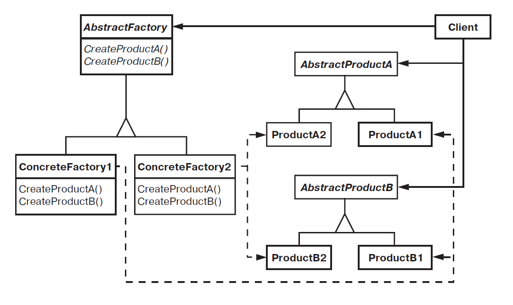

# Абстрактная фабрика (Abstract Factory)

Абстрактная фабрика — паттерн, порождающий объекты.

Предоставляет интерфейс для создания семейств взаимосвязанных или взаимозависимых объектов, не специфицируя их конкретных классов.

## Мотивация

Рассмотрим инструментальную программу для создания пользовательского интерфейса, поддерживающего разные стандарты оформления, например **Motif** и **Presentation Manager**.

Оформление определяет визуальное представление и поведение элементов пользовательского интерфейса («виджетов») — полос прокрутки, окон и кнопок. Чтобы приложение можно было перенести на другой стандарт, в нем не должно быть жестко закодировано оформление виджетов. Если создание экземпляров классов для конкретного оформления разбросано по всему приложению, то изменить оформление впоследствии будет нелегко.

Для решения этой проблемы можно определить абстрактный класс `WidgetFactory`, в котором объявлен интерфейс для создания всех основных видов виджетов. Есть также абстрактные классы для каждого отдельного вида и конкретные подклассы, реализующие виджеты с определенным оформлением. В интерфейсе `WidgetFactory` имеется операция, возвращающая новый объект-виджет для каждого абстрактного класса виджетов. Клиенты вызывают эти операции для получения экземпляров виджетов, но при этом ничего не знают о том, какие именно классы используются. Таким образом, клиенты остаются независимыми от выбранного стандарта оформления.

Для каждого стандарта оформления существует определенный подкласс `WidgetFactory`. Каждый такой подкласс реализует операции, необходимые для создания соответствующего стандарту виджета. Например, операция `CreateScrollBar` в классе `MotifWidgetFactory` создает экземпляр и возвращает полосу прокрутки в стандарте `Motif`, тогда как соответствующая операция в классе `PMWidgetFactory` возвращает полосу прокрутки в стандарте **Presentation Manager**. Клиенты создают виджеты, пользуясь исключительно интерфейсом `WidgetFactory`, и им ничего не известно о классах, реализующих виджеты для конкретного стандарта. Другими словами, клиенты должны лишь придерживаться интерфейса, определенного абстрактным, а не конкретным классом.

Класс `WidgetFactory` также устанавливает зависимости между конкретными классами виджетов. Полоса прокрутки для `Motif` должна использоваться с кнопкой и текстовым полем `Motif`, и это ограничение поддерживается автоматически как следствие использования класса `MotifWidgetFactory`.

## Структура

## Применимость

Основные условия для применения паттерна абстрактная фабрика:

 - Система не должна зависеть от того, как создаются, компонуются и представляются входящие в нее объекты;

 - Система должна настраиваться одним из семейств объектов;

 - Входящие в семейство взаимосвязанные объекты спроектированы для совместной работы, и вы должны обеспечить выполнение этого ограничения;

 - Вы хотите предоставить библиотеку объектов, раскрывая только их интерфейсы, но не реализацию.

## Участники

 - `AbstractFactory` (`WidgetFactory`) — абстрактная фабрика: объявляет интерфейс для операций, создающих абстрактные объекты-продукты;

 - `ConcreteFactory` (`MotifWidgetFactory`, `PMWidgetFactory`) — конкретная фабрика: реализует операции, создающие конкретные объекты-продукты;

 - `AbstractProduct` (`Window`, `ScrollBar`) — абстрактный продукт: объявляет интерфейс для типа объекта-продукта;

 - `ConcreteProduct` (`MotifWindow`, `MotifScrollBar`) — конкретный продукт: определяет объект-продукт, создаваемый соответствующей конкретной фабрикой; реализует интерфейс `AbstractProduct`;

 - `Client` — клиент: пользуется исключительно интерфейсами, которые объявлены в классах `AbstractFactory` и `AbstractProduct`.

## Отношения

Обычно во время выполнения создается единственный экземпляр класса `ConcreteFactory`. Эта конкретная фабрика создает объекты-продукты, имеющие вполне определенную реализацию. Для создания других видов объектов клиент должен воспользоваться другой конкретной фабрикой;

`AbstractFactory` передоверяет создание объектов-продуктов своему подклассу `ConcreteFactory`.

## Результаты

Паттерн абстрактная фабрика:

 - изолирует конкретные классы. Паттерн помогает контролировать классы объектов, создаваемых приложением. Поскольку фабрика инкапсулирует ответственность за создание классов и сам процесс их создания, то она изолирует клиента от подробностей реализации классов. Клиенты манипулируют экземплярами через их абстрактные интерфейсы. Имена изготавливаемых классов известны только конкретной фабрике, в коде клиента они не упоминаются;

 - упрощает замену семейств продуктов. Класс конкретной фабрики появляется в приложении только один раз: при создании экземпляра. Это облегчает замену используемой приложением конкретной фабрики. Приложение может изменить конфигурацию продуктов, просто подставив новую конкретную фабрику. Поскольку абстрактная фабрика создает все семейство продуктов, то и заменяется сразу все семейство. В нашем примере для переключения пользовательского интерфейса с виджетов `Motif` на виджеты `Presentation Manager` достаточно переключиться на продукты соответствующей фабрики и заново создать интерфейс;

 - гарантирует сочетаемость продуктов. Если продукты некоторого семейства спроектированы для совместного использования, то важно, чтобы приложение в каждый момент времени работало только с продуктами единственного семейства. Класс `AbstractFactory` позволяет легко соблюсти это ограничение;

 - не упрощает задачу поддержки нового вида продуктов. Расширение абстрактной фабрики для изготовления новых видов продуктов — непростая задача. Дело в том, что интерфейс `AbstractFactory` фиксирует набор продуктов, которые можно создать. Для поддержки новых продуктов необходимо расширить интерфейс фабрики, то есть изменить класс `AbstractFactory` и все его подклассы. Одно из возможных решений этой проблемы рассматривается в разделе «Реализация».

## Реализация

Некоторые полезные приемы реализации паттерна абстрактная фабрика:

 - Фабрики как объекты, существующие в единственном экземпляре. Как правило, приложению нужен только один экземпляр класса `ConcreteFactory` на каждое семейство продуктов. Поэтому для реализации лучше всего применить паттерн [одиночка](./singleton.md);

 - Создание продуктов. Класс `AbstractFactory` объявляет только интерфейс для создания продуктов. Фактическое их создание — дело подклассов `ConcreteProduct`. Чаще всего для этой цели определяется [фабричный метод](./factory_method.md) для каждого продукта. Конкретная фабрика определяет свои продукты путем замещения фабричного метода для каждого из них. Хотя такая реализация проста, она требует создавать новый подкласс конкретной фабрики для каждого семейства продуктов, даже если они почти ничем не отличаются.

 - Если семейств продуктов может быть много, то конкретную фабрику удастся реализовать с помощью паттерна [прототип](./prototype.md). В этом случае она инициализируется экземпляром-прототипом каждого продукта в семействе и создает новый продукт путем клонирования этого прототипа. Подход на основе прототипов устраняет необходимость создавать новый класс конкретной фабрики для каждого нового семейства продуктов.

 - Определение расширяемых фабрик. Класс `AbstractFactory` обычно определяет разные операции для всех видов изготавливаемых продуктов. Виды продуктов кодируются в сигнатуре операции. Для добавления нового вида продуктов нужно изменить интерфейс класса `AbstractFactory` и всех зависящих от него классов. Более гибкий, но менее безопасный способ — добавить параметр к операциям, создающим объекты. Данный параметр определяет вид создаваемого объекта. Это может быть идентификатор класса, целое число, строка или что-то еще, однозначно описывающее вид продукта. При таком подходе классу `AbstractFactory` нужна только одна операция Make с параметром, задающим тип создаваемого объекта. Данный прием применялся в обсуждавшихся выше абстрактных фабриках на основе прототипов и классов.