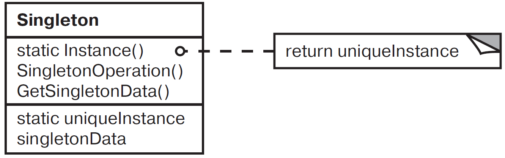

# Одиночка (Singleton)

Одиночка — паттерн, порождающий объекты.
Гарантирует, что у класса существует только один экземпляр, и предоставляет к нему глобальную точку доступа.

## Мотивация

Для некоторых классов важно, чтобы существовал только один экземпляр. В системе может быть много принтеров, но может существовать лишь один спулер. В операционной системе должна быть только одна файловая система и единственный оконный менеджер. В цифровом фильтре может находиться только один аналого-цифровой преобразователь (АЦП). Бухгалтерская система обслуживает только одну компанию.

Как гарантировать, что у класса есть единственный экземпляр и что этот экземпляр легко доступен? Глобальная переменная дает доступ к объекту, но не запрещает создать несколько экземпляров класса.
Более удачное решение — возложить на сам класс ответственность за то, что у него существует только один экземпляр. Класс может запретить создание дополнительных экземпляров, перехватывая запросы на создание новых объектов, и он же способен предоставить доступ к своему экземпляру. Это и есть назначение паттерна одиночка.

## Применимость
Основные условия для применения паттерна одиночка:
 - должен существовать ровно один экземпляр некоторого класса, к которому может обратиться любой клиент через известную точку доступа;

 - единственный экземпляр должен расширяться путем порождения подклассов, а клиенты должны иметь возможность работать с расширенным экземпляром без модификации своего кода.

## Структура 

## Участники
`Singleton` — одиночка:

 - определяет операцию `Instance`, которая позволяет клиентам получить доступ к единственному экземпляру. `Instance` — это операция класса, то есть статический метод.

 - может нести ответственность за создание собственного уникального экземпляра.

## Отношения
 - Клиенты получают доступ к экземпляру класса `Singleton` только через его операцию `Instance`.

## Результаты

Паттерн одиночка обладает рядом достоинств:

 - Контролируемый доступ к единственному экземпляру. Поскольку класс `Singleton` инкапсулирует свой единственный экземпляр, он полностью контролирует то, как и когда клиенты получают доступ к нему;

 - Сокращение пространства имен. Паттерн одиночка — шаг вперед по сравнению с глобальными переменными. Он позволяет избежать засорения пространства имен глобальными переменными, в которых хранятся уникальные экземпляры;

 - Возможность уточнения операций и представления. От класса `Singleton` можно порождать подклассы, а приложение легко настраивается экземпляром расширенного класса. Приложение можно настроить экземпляром нужного класса во время выполнения;

 - Возможность использования переменного числа экземпляров. Паттерн позволяет легко изменить решение и разрешить появление более одного экземпляра класса `Singleton`. Более того, тот же подход может использоваться для управления числом экземпляров, используемых в приложении. Изменить нужно будет лишь операцию, дающую доступ к экземпляру класса `Singleton`;

 - Большая гибкость, чем у операций класса. Другой способ реализации функциональности одиночки — использование статических методов. Но этот приём препятствует изменению дизайна, если потребуется разрешить наличие нескольких экземпляров класса.