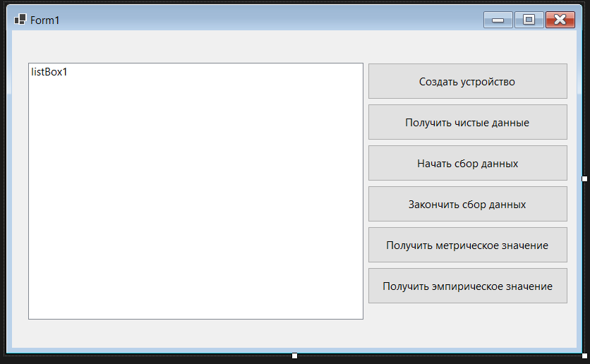

# Задание 2. Создание абстрактного класса

В этом задании мы определим класс `MeasureMassDevice`, который также реализует интерфейс `IMeasuringDevice`. Хотя методы `MetricValue` и `ImperialValue` будут реализованы несколько иначе, чем класс `MeasureLength`, методы `StartCollecting`, `StopCollecting`, `GetRawData` и `GetMeasurements` будут идентичны. Дублирование кода это плохо и может привести к трудностям в обслуживании. Следовательно, мы создадим абстрактный класс с именем `MeasureDataDevice`, который предоставляет реализации дублированных методов по умолчанию. Придётся изменить классы `MeasureLengthDevice` и `MeasureMassDevice`, чтобы они наследовались от этого класса.

Для начала создадим новый проект с графическим интерфейсом, например, так выглядит создание проекта с Windows Forms:


Теперь, исходя из задания, нам нужно реализовать интерфейс из предедущего задания.
Таким образом, можем его спокойно перекопировать. Создадим новый файл через **(Ctrl + Shift + A)**

### IMeasuringDevice

```C#
namespace MeasuringDevice
{
    public interface IMeasuringDevice
    {
        /// <summary>
        /// Преобразует необработанные данные, собранные устройством измерения, в значение в метрических единицах.
        /// </summary>
        /// <returns>Последнее измерение устройства преобразовано в метрические единицы.</returns>
        decimal MetricValue();

        /// <summary>
        /// Преобразует необработанные данные, собранные устройством измерения, в значение в имперических единицах.
        /// </summary>
        /// <returns>Последнее измерение устройства преобразовано в имперические единицы.</returns>
        decimal ImperialValue();

        /// <summary>
        /// Запускает сбор данных устройства измерения.
        /// </summary>
        void StartCollecting();

        /// <summary>
        /// Останавливает сбор данных устройства измерения.
        /// </summary>
        void StopCollecting();

        /// <summary>
        /// Предоставляет доступ к необработанным данным, собранным устройством измерения, в любых единицах, используемых устройством.
        /// </summary>
        /// <returns>Необработанные данные, собранные устройством измерения, в их сыром формате.</returns>
        int[] GetRawData();
    }
}
```

Также нам понадобится `DeviceType` из предедущего задания. Его реализовывали самостоятельно, вот его реализация:

### DeviceType

```C#
namespace DeviceTypeNS
{
    public enum DeviceType
    {
        LENGTH,
        MASS
    }
}
```

И ещё нам понадобится ранее самостоятельно реализованный `DeviceController`:

### DeviceController

```C#
using DeviceTypeNS;

namespace DeviceControllerNS
{
    public class DeviceController
    {
        DeviceType measurementType;
        bool isStopped;

        public DeviceController(DeviceType measurementType)
        {
            this.measurementType = measurementType;
            this.isStopped = false;
        }

        public static DeviceController StartDevice(DeviceType measurementType)
        {
            return new DeviceController(measurementType);
        }

        public void StopDevice()
        {
            this.isStopped = true;
        }

        public int TakeMeasurement()
        {
            if (!this.isStopped)
            {
                Random random = new Random();
                return random.Next(1, 10);
            }
            throw new Exception("Устройство остановлено, однако, была попытка сделать измерение");
        }
    }
}
```

Теперь абстрактный класс, от которого мы будем наследовать, также можно спокойно скопировать в отдельный файл.

```C#
using DeviceTypeNS;
using DeviceControllerNS;

namespace MeasuringDevice
{
    public abstract class MeasureDataDevice : IMeasuringDevice
    {
        /// <summary>
        /// Преобразует необработанные данные, собранные устройством измерения, в значение в метрических единицах.
        /// </summary>
        /// <returns>Последнее измерение устройства преобразовано в метрические единицы.</returns>
        public abstract decimal MetricValue();
        /// <summary>
        /// Преобразует необработанные данные, собранные устройством измерения, в значение в имперических единицах.
        /// </summary>
        /// <returns>Последнее измерение устройства преобразовано в имперические единицы.</returns>
        public abstract decimal ImperialValue();
        /// <summary>
        /// Запускает сбор данных устройства измерения.
        /// </summary>
        public void StartCollecting()
        {
            controller = DeviceController.StartDevice(measurementType);
            GetMeasurements();
        }
        /// <summary>
        /// Останавливает сбор данных устройства измерения.
        /// </summary>
        public void StopCollecting()
        {
            if (controller != null)
            {
                controller.StopDevice();
                controller = null;
            }
        } 
    }
}
```

Заметим, что многое сейчас подчёркнуто красной волнистой полоской.

Нажмём на название нашего класса `MeasureDataDevice`,
после чего прожмём сочетание **(CTRL + '.')**. Выберем **Реализовать интерфейс абстрактно**

Как видим, нужные методы интерфейса теперь автоматически реализованы абстрактно. Однако,
такие методы, как `GetRawData` и `GetMeasurements` придётся реализовать по умолчанию. А ещё множество полей всё ещё подчёркнуты красным, поэтому их также надо реализовать.
Всё это также можно взять из предедущего задания:

Поля сделаем публичными, так как это соответствует задаче абстрактного класса.

```C#
public int[] dataCaptured;
public int mostRecentMeasure;
public DeviceController? controller;
public DeviceType measurementType;
```

Добавим метод `GetMeasurements`, который ранее просто скопировали, пора это снова повторить.

### GetMeasurements

```C#
public void GetMeasurements()
{
    dataCaptured = new int[10];
    System.Threading.ThreadPool.QueueUserWorkItem((dummy) =>
    {
        int x = 0;
        Random timer = new Random();

        while (controller != null)
        {
            System.Threading.Thread.Sleep(timer.Next(1000, 5000));
            dataCaptured[x] = controller != null ?
                controller.TakeMeasurement() : dataCaptured[x];
            mostRecentMeasure = dataCaptured[x];
            x++;
            if (x == 10)
            {
                x = 0;
            }
        }
    });
}
```

### MeasureDataDevice

```C#
using DeviceTypeNS;
using DeviceControllerNS;

namespace MeasuringDevice
{
    public abstract class MeasureDataDevice : IMeasuringDevice
    {
        public int[] dataCaptured;
        public int mostRecentMeasure;
        public DeviceController? controller;
        public DeviceType measurementType;
        /// <summary>
        /// Преобразует необработанные данные, собранные устройством измерения, в значение в метрических единицах.
        /// </summary>
        /// <returns>Последнее измерение устройства преобразовано в метрические единицы.</returns>
        public abstract decimal MetricValue();
        /// <summary>
        /// Преобразует необработанные данные, собранные устройством измерения, в значение в имперических единицах.
        /// </summary>
        /// <returns>Последнее измерение устройства преобразовано в имперические единицы.</returns>
        public abstract decimal ImperialValue();
        /// <summary>
        /// Запускает сбор данных устройства измерения.
        /// </summary>
        public void StartCollecting()
        {
            controller = DeviceController.StartDevice(measurementType);
            GetMeasurements();
        }
        /// <summary>
        /// Останавливает сбор данных устройства измерения.
        /// </summary>
        public void StopCollecting()
        {
            if (controller != null)
            {
                controller.StopDevice();
                controller = null;
            }
        }

        public void GetMeasurements()
        {
            dataCaptured = new int[10];
            System.Threading.ThreadPool.QueueUserWorkItem((dummy) =>
            {
                int x = 0;
                Random timer = new Random();

                while (controller != null)
                {
                    System.Threading.Thread.Sleep(timer.Next(1000, 5000));
                    dataCaptured[x] = controller != null ?
                        controller.TakeMeasurement() : dataCaptured[x];
                    mostRecentMeasure = dataCaptured[x];
                    x++;
                    if (x == 10)
                    {
                        x = 0;
                    }
                }
            });
        }


        public int[] GetRawData()
        {
            return dataCaptured;
        }
    }
}
```

Теперь нам нужно создать класс `MeasureMassDevice`. Жмём **(CTRL + SHIFT + A)**
Новый класс также нужно сделать публичным. Пока оставим его пустым.

Также скопируем самостоятельно реализованный класс `MeasureLengthDevice` в отдельный файл.

```C#
public class MeasureLengthDevice : IMeasuringDevice
    {
        private Units unitsToUse;
        private int[] dataCaptured;
        private int mostRecentMeasure;
        private DeviceController? controller;
        private const DeviceType measurementType = DeviceType.LENGTH;

        public MeasureLengthDevice(Units unitsToUse)
        {
            this.unitsToUse = unitsToUse;
            this.dataCaptured = new int[0];
        }

        public int[] GetRawData()
        {
            return dataCaptured;
        }

        public decimal ImperialValue()
        {
            switch (unitsToUse)
            {
                case Units.Metric:
                    return (decimal)(mostRecentMeasure * 0.03937);
                case Units.Imperial:
                    return mostRecentMeasure;
                default:
                    throw new NotImplementedException();
            }
        }

        public decimal MetricValue()
        {
            switch (unitsToUse)
            {
                case Units.Metric:
                    return mostRecentMeasure;
                case Units.Imperial:
                    return (decimal)(mostRecentMeasure * 25.4);
                default:
                    throw new NotImplementedException();
            }
        }

        public void StartCollecting()
        {
            controller = DeviceController.StartDevice(measurementType);
            GetMeasurements();
        }

        public void StopCollecting()
        {
            if (controller != null)
            {
                controller.StopDevice();
                controller = null;
            }
        }

        private void GetMeasurements()
        {
            dataCaptured = new int[10];
            System.Threading.ThreadPool.QueueUserWorkItem((dummy) =>
            {
                int x = 0;
                Random timer = new Random();

                while (controller != null)
                {
                    System.Threading.Thread.Sleep(timer.Next(1000, 5000));
                    dataCaptured[x] = controller != null ?
                        controller.TakeMeasurement() : dataCaptured[x];
                    mostRecentMeasure = dataCaptured[x];
                    x++;
                    if (x == 10)
                    {
                        x = 0;
                    }
                }
            });
        }
    }
```

Заметим, что `Units` у нас нет, поэтому самостоятельно реализованный `Units` также нужно скопировать в отдельный файл:

### Units

```C#
namespace UnitsEnumeration
{
    /// <summary>
    /// Перечисление, которое используется для указания системы измерения.
    /// </summary>
    public enum Units
    {
        Metric,
        Imperial
    }
}
```

Добавим `using UnitsEnumeration` в файл нашего класса `MeasureLengthDevice`.
Примерно так теперь должны выглядить наши `using`:

```C#
using DeviceControllerNS;
using DeviceTypeNS;
using MeasuringDevice;
using UnitsEnumeration;
//...
```

Теперь заменим реализацию интерфейса на наследование от нашего нового абстрактного класса
[MeasureDataDevice](#measuredatadevice):

```C#
//...
public class MeasureLengthDevice : MeasureDataDevice
//...
```

Теперь вспомним как выглядит наш абстрактный класс:

 - Все поля публичные, реализованы такие поля, как `dataCaptured`, `mostRecentMeasure`, `controller`, `measurementType`
 - Методы `MetricValue` и `ImperialValue` абстрактные, их наследникам нужно реализовывать самим.
 - Методы `StartCollecting`, `StopCollecting`, `GetMeasurements`, `GetRawData` имеют реализацию по умолчанию, их реализовывать необязательно, а в нашем случае их реализовывать не нужно.

Раз мы об этом всём вспомнили, вернёмся к нашему классу `MeasureLengthDevice`.

Начнём с самого простого, удалим такие поля, как `dataCaptured`, `mostRecentMeasure`, `controller`, `measurementType`, так как они имеют реализацию по умолчанию.

По той же причине удалим методы `StartCollecting`, `StopCollecting`, `GetMeasurements`, `GetRawData`.

Теперь добавим к методам `MetricValue` и `ImperialValue` модификатор `override`, чтобы перегрузить реализацию абстрактного класса.

Помимо этого подправим поле measurementType.

И всё, класс готов. Вот его возможная реализация:

### MeasureLengthDevice
```C#
public class MeasureLengthDevice : MeasureDataDevice
{
    private Units unitsToUse;
    new private const DeviceType measurementType = DeviceType.LENGTH;

    public MeasureLengthDevice(Units unitsToUse)
    {
        this.unitsToUse = unitsToUse;
        this.dataCaptured = new int[0];
    }

    override public decimal ImperialValue()
    {
        switch (unitsToUse)
        {
            case Units.Metric:
                return (decimal)(mostRecentMeasure * 0.03937);
            case Units.Imperial:
                return mostRecentMeasure;
            default:
                throw new NotImplementedException();
        }
    }

    override public decimal MetricValue()
    {
        switch (unitsToUse)
        {
            case Units.Metric:
                return mostRecentMeasure;
            case Units.Imperial:
                return (decimal)(mostRecentMeasure * 25.4);
            default:
                throw new NotImplementedException();
        }
    }
}
```

Теперь вернёмся к классу `MeasureMassDevice`. Его нужно реализовать самостоятельно, но, благодаря использованию абстрактного класса не весь. Делаем что-то наподобие [MeasureLengthDevice](#measurelengthdevice). Для начала, добавим наследование от абстрактного класса:

```C#
using MeasuringDevice;

namespace MeasureMassDeviceNS
{
    public class MeasureMassDevice: MeasureDataDevice
    {
    }
}
```

Нажимаем на название нашего класса и жмём **(Ctrl + '.')**, а затем выбираем **реализовать абстрактный класс**. Должны были появиться заглушки для методов `ImperialValue` и `MetricValue`.

Дальнейшая реализация зависит лишь от вашей фантазии. <br/>
В том числе и интерфейса... <br/>
Копировать неоткуда...

## Бонус: реализация класса `MeasureMassDevice`

Для начала вспомним, как выглядела реализация [MeasureLengthDevice](#measurelengthdevice), а точнее её "нестандартная часть".

Сначала реализуем поля `unitsToUse`, `measurementType`.

```C#
//...
private Units unitsToUse;
new private const DeviceType measurementType = DeviceType.MASS;
//...
```

Реализуем конструктор для класса `MeasureMassDevice`:

```C#
//...
public MeasureMassDevice(Units unitsToUse)
{
    this.unitsToUse = unitsToUse;
    this.dataCaptured = new int[0];
}
//...
```

И пока просто скопируем методы `ImperialValue` и `MetricValue` из класса [MeasureLengthDevice](#measurelengthdevice):

```C#
override public decimal ImperialValue()
{
    switch (unitsToUse)
    {
        case Units.Metric:
            return (decimal)(mostRecentMeasure * 0.03937);
        case Units.Imperial:
            return mostRecentMeasure;
        default:
            throw new NotImplementedException();
    }
}

override public decimal MetricValue()
{
    switch (unitsToUse)
    {
        case Units.Metric:
            return mostRecentMeasure;
        case Units.Imperial:
            return (decimal)(mostRecentMeasure * 25.4);
        default:
            throw new NotImplementedException();
    }
}
```

Вспомним, что такое метрическая система...

 > Метрическая система или Международная система единиц (СИ) основана на семи базовых единицах для семи    базовых измерений, независимых друг от друга. Вот эти измерения и единицы: длина (метр), масса    (килограмм), время (секунда), электрический ток (ампер), термодинамическая температура (кельвин),    количество вещества (моль) и интенсивность излучения (кандела).

Вспомним, в чём в имперской системе измеряется масса, достатоно вспомнить только фунт...

 > 1 фунт = 12 унциям

Теперь подумаем, в чём будет измеряться масса в нашем классе `MeasureMassDevice`. Пожалуй, это будут килограммы в (СИ) и футы в имперской системе.

Тогда в методе `ImperialValue` в первом кейсе надо как-то перевести килограммы в футы. Для этого узнаём, что в одном футе 0.4535924 кг, а в одном кг 2.2046226 футов.

Наконец, без проблем перепишем наш метод `ImperialValue`:

```C#
override public decimal ImperialValue()
{
    switch (unitsToUse)
    {
        case Units.Metric:
            return (decimal)(mostRecentMeasure * 2.2046226);
        case Units.Imperial:
            return mostRecentMeasure;
        default:
            throw new NotImplementedException();
    }
}
```

А также метод `MetricValue`:

```C#
override public decimal MetricValue()
{
    switch (unitsToUse)
    {
        case Units.Metric:
            return mostRecentMeasure;
        case Units.Imperial:
            return (decimal)(mostRecentMeasure * 0.4535924);
        default:
            throw new NotImplementedException();
    }
}
```

Класс готов, вот его реализация:

## MeasureMassDevice

```C#
using DeviceTypeNS;
using MeasuringDevice;
using UnitsEnumeration;

namespace MeasureMassDeviceNS
{
    public class MeasureMassDevice : MeasureDataDevice
    {
        private Units unitsToUse;
        new private const DeviceType measurementType = DeviceType.MASS;

        public MeasureMassDevice(Units unitsToUse)
        {
            this.unitsToUse = unitsToUse;
            this.dataCaptured = new int[0];
        }
        override public decimal ImperialValue()
        {
            switch (unitsToUse)
            {
                case Units.Metric:
                    return (decimal)(mostRecentMeasure * 2.2046226);
                case Units.Imperial:
                    return mostRecentMeasure;
                default:
                    throw new NotImplementedException();
            }
        }

        override public decimal MetricValue()
        {
            switch (unitsToUse)
            {
                case Units.Metric:
                    return mostRecentMeasure;
                case Units.Imperial:
                    return (decimal)(mostRecentMeasure * 0.4535924);
                default:
                    throw new NotImplementedException();
            }
        }
    }
}
// Meow
```

## Бонус: Интерфейс приложения:

**Всех этих элементов две штуки:**

 - Listbox или что-то такое чтобы отображать данные.

 - Кнопка "Получить необработанные данные": выводит полученные данные на экран.

 - Кнопка создания устройства: Нужно создать экземпляр `MeasureLengthDevice` и записать в поле `device`.
 - При его создании необходимо использовать выбранную систему измерения.

 - Кнопка начала сбора: Нужно запустить метод StartCollecting на нашем измерительном устройстве.

 - Кнопка окончания сбора: Нужно как-то завершить сбор данных.

 - Кнопка "Метрическое значение": выводит последнее измерение устройства в метрической системе.

 - Кнопка "Эмпирическое значение": выводит последнее измерение устройства в эмпирической системе.

Пример интерфейса для [MeasureLengthDevice](#measurelengthdevice):

