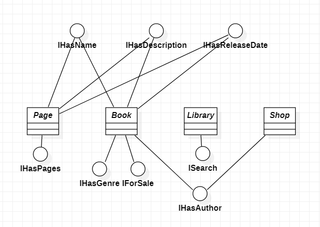
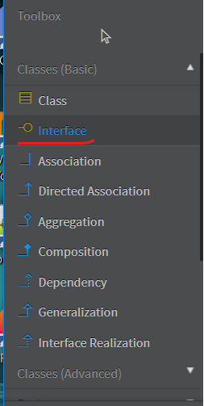
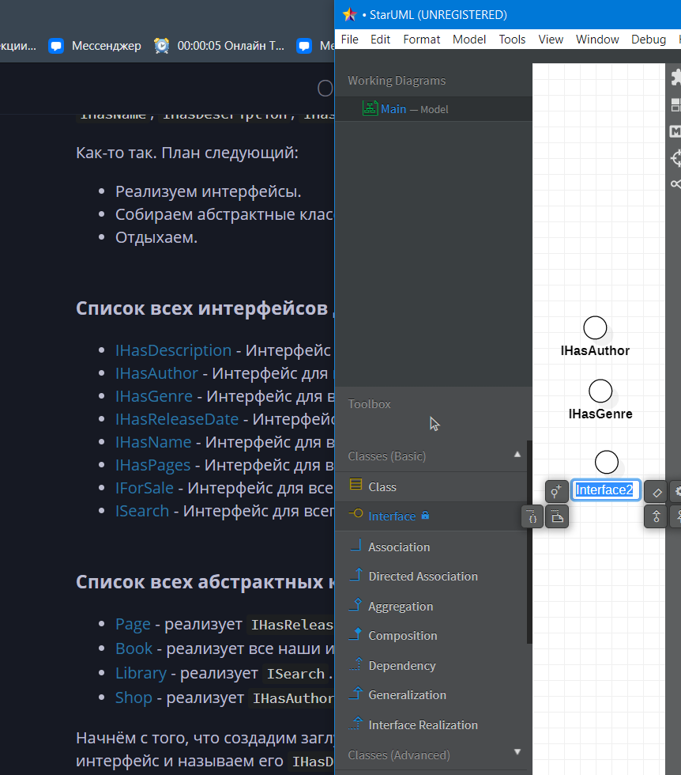
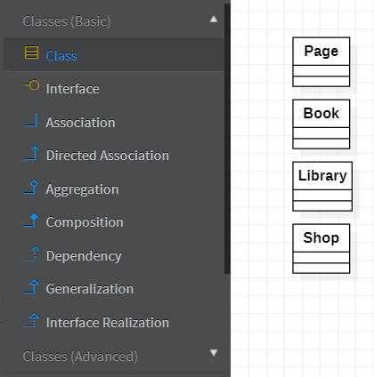
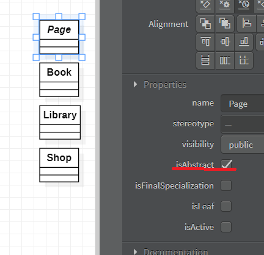
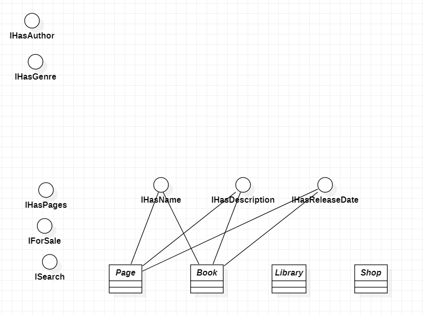

# Задание 3. Создание архитектуры приложения с помощью интерфейсов

Последовательность выполнения задания следующая:

1.	Изучить возможность и преимущества создания архитектуры приложения с помощью интерфейсов.
2.	Написать в отчет о работе краткую справку об использовании абстрактных классов и интерфейсов при проектировании крупных промышленных приложений. Советуем посмотреть видеоурок https://www.youtube.com/watch?v=eXapyrhtj7I&t=111s
3.	Создать архитектуру собственного приложения с помощью интерфейсов.
Обеспечить частичную или полную реализацию классов.
В качестве примера можно выбрать: книжный магазин, расширенный блокнот для делопроизводства, интернет магазин для продажи компьютеров и т.п.
4.	Разработать и включить в отчет диаграмму UML для вашего приложения.

## Часть 1

Интерфейсы - это основной кирпичик, позволяющий использовать композицию вместо наследования. Ознакомимся с тем, что же такое эта "композиция"


### Композиция вместо наследования

#### [Википедия:](https://en.wikipedia.org/wiki/Composition_over_inheritance)

Предпочтение композиции перед наследованием - это принцип проектирования, который придает дизайну большую гибкость. Более естественно создавать классы бизнес-домена из различных компонентов, чем пытаться найти общность между ними и создавать генеалогическое древо. Например, педаль акселератора и рулевое колесо имеют очень мало общих черт, но оба являются жизненно важными компонентами автомобиля. Что они могут делать и как их можно использовать с пользой для автомобиля, легко определить. Композиция также обеспечивает более стабильную бизнес-сферу в долгосрочной перспективе, поскольку она менее подвержена причудам членов семьи. Другими словами, лучше составить то, что объект может делать (имеет-a), чем расширять то, что он есть (is-a).

Первоначальное проектирование упрощается за счет определения поведения системных объектов в отдельных интерфейсах вместо создания иерархической взаимосвязи для распределения поведения между классами бизнес-домена посредством наследования. Этот подход легче приспосабливается к будущим изменениям требований, которые в противном случае потребовали бы полной реструктуризации классов бизнес-домена в модели наследования. Кроме того, это позволяет избежать проблем, часто связанных с относительно незначительными изменениями в модели, основанной на наследовании, которая включает несколько поколений классов. Композиционное отношение более гибкое, поскольку его можно изменять во время выполнения, в то время как отношения подтипов статичны и требуют перекомпиляции на многих языках.

Некоторые языки, в частности **Go** и **Rust**, используют исключительно **type composition**.


#### Шаблоны игрового программирования. Роберт Найстром

 > Дальнейший материал данного пункта полностью взят из перевода указанной [книги](https://martalex.gitbooks.io/gameprogrammingpatterns/content/chapter-5/5.1-component.html).

Когда объектно-ориентированное программирование появилось на сцене
впервые, наследование было самым любимым из всех его инструментов. Оно
было объявлено ультимативным молотом повторного использования кода и
кодеры постоянно им размахивали. С тех пор мы на собственных ошибках
убедились в том, что этот молот может быть слишком тяжел. Наследование имеет
свое применение, но для повторного использования кода оно обычно слишком
громоздко.

Ему на замену в программирование пришел новый тренд: композиция взамен
наследования везде, где это возможно. Вместо совместного использования кода двумя
классами, которые наследуются от какого-то одного класса, мы позволяем им обеим
обладать одним и тем же экземпляром этого класса.

## Часть 2.

Возможную версию справки об использовании абстрактных классов и интерфейсов при проектировании крупных промышленных приложений можно посмотреть [тут](../../appendix/intefaces_and_abstract_classes_in_app_design.md).

## Часть 3.

Для начала определимся с идеей. Тут у нас в приоритете создание чего-то такого промышленного.
Возможные идеи:

 - книжный магазин.
 - расширенный блокнот для делопроизводства.
 - интернет магазин для продажи компьютеров.
 - http веб фреймворк.
 - веб-сервис по генерации изображений искусственным интеллектом.
 - веб-сервис по разработке дизайна приложения.
 - канбан доска.

Тут мы ограничены лишь своей фантазией.
Заметим, что сказано частично или полностью реализовать классы, что будет проблемой при создании абсолютно воображаемого приложения. 

### Возможная реализация архитектуры приложения с помощью интерфейсов

Ну что же, проект делать всеравно другой в итоге, сделаем книжный магазин!
В интерфейсы пожалуй будем добавлять только методы.

Итак, какие сущности обитают в книжном магазине? Книги?
В общем так, рассмотрим воображаемый сайт книжного магазина. Там обязательно есть кнопочка купить, 
есть страничка книги, есть поиск книг... На этом пожалуй хватит.

Пускай будет интерфейс `IBook`, хотя, тогда в нём будут лишь поля, да и громоздний наверное выйдет интерфейс...

Тогда сделаем интерфейсы `IHasDescription`, `IHasAuthor`, `IHasGenre`, `IHasReleaseDate`, `IHasName`, `IPage`, `IHasPages`.


Также, пускай будет интерфейс `IForSale`, 
Из `IHasDescription`, `IHasAuthor`, `IHasGenre`, `IHasReleaseDate`, `IHasName`, `IHasPages`, `IForSale`. соберём класс книги, а потом попробуем собрать что-нибудь ещё.

Пускай будет интерфейс `ISearch`, который будет реализовывать возможность гибкого поиска по какой-либо коллекции, пускай будет абстрактный класс `Library` который будет использовать `ISearch`.

Также добавим абстрактный класс магазина `Shop`, где используем интерфейсы `IHasAuthor`, `IHasName`, `IHasDescription`, `IHasReleaseDate`

Как-то так. План следующий:
 - Реализуем интерфейсы.
 - Собираем абстрактные классы.
 - Отдыхаем.

### Список всех интерфейсов для реализации:
 - [IHasDescription](#ihasdescription) - Интерфейс для всего, что имеет описание.
 - [IHasAuthor](#ihasauthor) - Интерфейс для всего, у чего есть автор.
 - [IHasGenre](#ihasgenre) - Интерфейс для всего, у чего есть жанр.
 - [IHasReleaseDate](#ihasreleasedate) - Интерфейс для всего, у чего есть дата выпуска.
 - [IHasName](#ihasname) - Интерфейс для всего, у чего есть имя или название.
 - [IHasPages](#ihaspages) - Интерфейс для всего, у чего есть страницы.
 - [IForSale](#iforsale) - Интерфейс для всего, что можно продать.
 - [ISearch](#isearch) - Интерфейс для всего, что может реализовывать поиск.

### Список всех абстрактных классов для реализации:
 - [Page](#page) - реализует `IHasReleaseDate`, `IHasName`, `IHasDescription`.
 - [Book](#book) - реализует все наши интерфейсы, кроме `ISearch`.
 - [Library](#library) - реализует `ISearch`.
 - [Shop](#shop) - реализует `IHasAuthor`, `IHasName`, `IHasDescription`, `IHasReleaseDate`.

Начнём с того, что создадим заглушки под каждый интерфейс.
Жмём **(Ctrl+Shift+A)**, выбираем интерфейс и называем его `IHasDescription`, создаём.

Теперь проделаем это со всеми остальными, тоесть `IHasAuthor`, `IHasGenre`, `IHasReleaseDate`, `IHasName`, `IHasPages`, `IForSale`, `ISearch`.

Перед тем, как реализовывать `IHasPages`, придётся реализовать абстрактный класс `Page`, который будет реализовывать интерфейсы `IHasReleaseDate`, `IHasName`, `IHasDescription`

Хочется отметить, что в ходе выполнения работы список интерфейсов постоянно менялся, а они самым неожиданным образом становились частями разных классов, хотя изначально создавались только для Book и Library. Это ещё раз подчёркивает гибкость [композиции](#википедия).

А теперь спокойненько всё реализовываем. Вот примерная реализация:

### IHasDescription
```C#
public interface IHasDescription
{
    string Description { get; set; }

    bool HasDescription() { return Description!= null && Description.Trim().Length > 0; }

    void FormatDescription() { Description = Description.Trim(); }

    void ClearDescription() { Description = ""; }

    void GetDescription() { "Описание: ".Concat(Description); }
}
```
### IHasAuthor
```C#
public interface IHasAuthor
{
    string AuthorName { get; }

    uint AuthorAge { get; }

    string AuthorAbout { get; }

    bool ValidateAuthor();
}
```
### IHasGenre
```C#
public interface IHasGenre
{
    HashSet<string> Genres { get; }

    bool ContainsGenre(string genre) { return Genres.Contains(genre); }

    string[] GetGenres() { return Genres.ToArray(); }

    void AddGenre(string genre) { Genres.Add(genre); }

    void RemoveGenre(string genre) { Genres.Remove(genre); }

}
```
### IHasReleaseDate
```C#
public interface IHasReleaseDate
{
    DateTime releaseDate { get; set; }

    void ReleaseBook() { releaseDate = DateTime.Now.ToUniversalTime(); }

    void SetReleaseDate(DateTime releaseDate) { releaseDate = releaseDate.ToUniversalTime(); }

    DateTime ReleasedAt() { return releaseDate; }

    bool isOlderReleased(DateTime someDate) { return releaseDate > someDate; }

    bool isNewerReleased(DateTime someDate) { return releaseDate < someDate; }
}
```
### IHasName
```C#
public interface IHasName
{
    string Name { get; }

    bool IsValidName(string name);

}
```

Мы дошли до IHasPages, а значит, пора реализовывать первый абстрактный класс - `Page`
Он должен реализовывать интерфейсы `IHasReleaseDate`, `IHasName`, `IHasDescription`.

Напишем, что мы их реализуем:

```C#
public abstract class Page: IHasReleaseDate, IHasName, IHasDescription
{

}
```

А затем нажмём по всем интерфейсам **(Ctrl + '.')** и создадим заглушки, а также создадим таким же образом конструктор, после чего просто пойдём дальше делать каркас нашего приложения.

Версия с заглушками: 
```C#
public abstract class Page : IHasReleaseDate, IHasName, IHasDescription
{
    public DateTime releaseDate { get => throw new NotImplementedException(); set => throw new NotImplementedException(); }

    public string Name => throw new NotImplementedException();

    public string Description { get => throw new NotImplementedException(); set => throw new NotImplementedException(); }

    public bool IsValidName(string name)
    {
        throw new NotImplementedException();
    }
}
```

### IHasPages
```C#
public interface IHasPages
{
    Page[] pages { get; set; }

    int pagesCount() { return pages.Length; }

    void addPage(Page newPage) { pages.Append(newPage); }
    void removePage(int pageNumber) { pages = pages.Where((_, idx) => idx != pageNumber).ToArray(); }
}
```
### IForSale
```C#
public interface IForSale
{
    int price { get; set; }

    int discount { get; set; }

    int getPrice() { return Math.Max(price - discount, 0); }
}
```
### ISearch
```C#
public interface ISearch <T>
{
    T[] SearchAll();

    T Find(Func<T, bool> predicate);
}
```

Теперь, когда мы реализовали все интерфейсы, пока бы начать реализовывать классы.

### Page

```C#
public abstract class Page : IHasReleaseDate, IHasName, IHasDescription
{
    protected Page(DateTime releaseDate, string name, string description)
    {
        this.releaseDate = releaseDate;
        this.name = name;
        this.description = description;
    }

    public DateTime releaseDate { get; set; }
    public string name { get; set; }
    public string description { get; set; }

    public string Name => name;

    public string Description { get => description; set { description = value; } }

    abstract public bool IsValidName(string name);
}
```
Для книги нам необходимо реализовать все наши интерфейсы кроме `ISearch`:

```C#
public abstract class Book: IForSale, IHasAuthor, IHasDescription, IHasGenre, IHasName, IHasPages, IHasReleaseDate
{

}
```

 > Совет: пользуйтесь **(Ctrl + '.')** для реализации интерфейсов.

### Book

```C#
public abstract class Book : IForSale, IHasAuthor, IHasDescription, IHasGenre, IHasName, IHasPages, IHasReleaseDate
{
    protected Book(string name, int price, int discount, string authorName, uint authorAge, string authorAbout, string description, Page[] pages, DateTime releaseDate)
    {
        this.name = name;
        this.price = price;
        this.discount = discount;
        this.authorName = authorName;
        this.authorAge = authorAge;
        this.authorAbout = authorAbout;
        Description = description;
        this.pages = pages;
        this.releaseDate = releaseDate;
    }

    public string name { get; set; }
    public int price { get; set; }
    public int discount { get; set; }
    public string authorName { get; set; }
    public uint authorAge { get; set; }
    public string authorAbout { get; set; }
    public string AuthorName => authorName;

    public uint AuthorAge => authorAge;

    public string AuthorAbout => authorAbout;

    public string Description { get; set; }
    public abstract HashSet<string> Genres { get; }

    public string Name => name;

    public Page[] pages { get; set; }
    public DateTime releaseDate { get; set; }

    public abstract bool IsValidName(string name);

    public abstract bool ValidateAuthor();
}
```

Library` должен реализовывать `ISearch`.
### Library

```C#
public abstract class Library : ISearch<Book>
{
    public abstract Book Find(Func<Book, bool> predicate);
    public abstract Book[] SearchAll();
}
```

Абстрактный класс `Shop` реализует интерфейсы `IHasAuthor`, `IHasName`, `IHasDescription`, `IHasReleaseDate`

### Shop

```C#
public abstract class Shop : IHasAuthor, IHasName, IHasDescription, IHasReleaseDate
{
    protected Shop(string authorName, uint authorAge, string authorAbout, string name, string description, DateTime releaseDate)
    {
        AuthorName = authorName;
        AuthorAge = authorAge;
        AuthorAbout = authorAbout;
        Name = name;
        Description = description;
        this.releaseDate = releaseDate;
    }

    public string AuthorName { get; }
    public uint AuthorAge { get; }
    public string AuthorAbout { get; }
    public string Name { get; }
    public string Description { get; set; }
    public DateTime releaseDate { get; set; }

    public abstract bool IsValidName(string name);
    public abstract bool ValidateAuthor();
}
```

## Часть 4.

Для построения UML диаграмм рекомендуется использовать [StarUML](https://staruml.io)

Вот такая диаграмма вышла в итоге:


Перейдём к процессу создания такой диаграммы:

После открытия программы у нас уже есть диаграмма **Main**, это и есть диаграмма классов.


Далее выберем интерфейс в меню слева:



И начнём добавлять в диаграмму наши интерфейсы:



После добавления интерфейсов добавим классы:



Обозначим их все абстрактными:



Теперь нам надо правильно соединить интерфейсы. Я начну с тех, которые были реализованы сразу во многих классах. Для этого посмотрим на то, [какие классы что реализуют](#Список-всех-абстрактных-классов-для-реализации).

Для отображения реализации интерфейсов используйте тип соединения **Inteface Realization**

Заметим, что интерфейсы `IHasName`, `IHasDescription`, `IHasReleaseDate` были реализованы сразу в двух классах. Поэтому их мы соединим первыми:



Кстати, стоило бы заметить и то, что `IHasAuthor` также реализован в двух классах, но бывает.

Теперь соединим оставшиеся:

### Конечная диаграмма классов:


