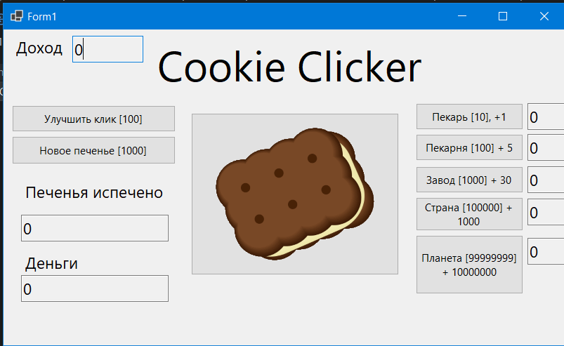

# Задание 3. Создание собственных событий

Задачи:
 1. Написать простое приложение с реализацией собственного события и подпиской на это событие со стороны внешних классов.
 2. Реализовать асинхронное CallBack событие.

Далее делаем что хотим.

Первое что пришло в голову кликер и вот что в итоге получилось:



Такие интерфейсы пришлось реализовать:
 - IBuyable: всё что можно купить
 - IHasPrice: всё у чего есть цена
 - IIncreasesIncome: всё что увеличивает инком
 - IRisesInPrice: всё что растёт в цене
 - ITech: всё что технология

Далее из этих интерфейсов были собраны классы:
 - абстрактный класс `Product` : `IHasPrice`, `IRisesInPrice`, `IBuyable`
 - класс `IncomeProduct` : `Product`, `IIncreasesIncome`
 - класс `TechProduct` : `Product`, `ITech`

Также отдельно был разработан класс `Game`, где хранились "продукты" в хеш таблицах, а также хранился инком, число денег, число печенек, цена печенек, цена клика (сколько клик даёт печенек).

Собтственные события:
 - `TechEvent` в `ITech`
 - `BoughtEvent` в `IBuyable`
 - `GotIncome` в `Game`
 - `MoneyChanged` в `Game`
 - `IncreaseIncome` в `IIncreasesIncome`

Асинхронный код и асинхронное callback событие:

## Game
```C#
//...
public void StartGame()
{
    IncomeWorker.ProgressChanged += new ProgressChangedEventHandler((object? sender, ProgressChangedEventArgs e) =>
    {
        GotIncome?.Invoke(this, new IncomeEvent(currentIncome));
        onMoneyChange();
    });
    IncomeWorker.DoWork += (target, e) =>
    {
        while (IncomeWorker.CancellationPending == false)
        {
            money += currentIncome * cookiePrice;
            cookies += currentIncome;
            IncomeWorker.ReportProgress(0);
            Thread.Sleep(incomeCd);
        }
    };
    IncomeWorker.RunWorkerAsync();
}
//...
```