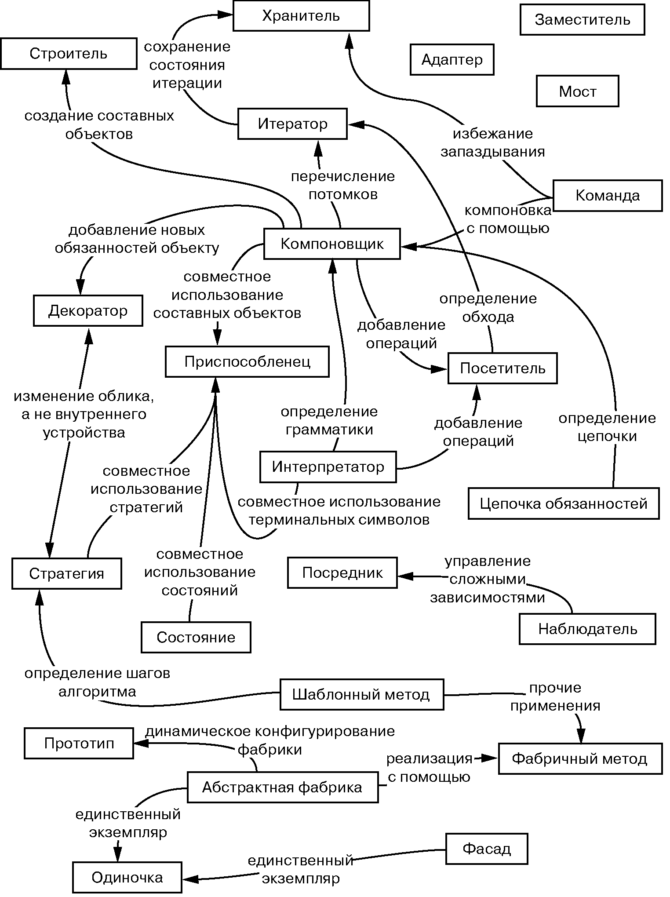

# Задание 1. Написать в отчет о практической работе небольшой авторский реферат о паттернах проектирования

# ВНИМАНИЕ! ДАННАЯ ГЛАВА НАХОДИТСЯ В РАЗРАБОТКЕ!

Задание 1. Написать в отчет о практической работе небольшой авторский реферат о паттернах проектирования:

Описать структуры паттернов:

1. Порождающие паттерны — паттерны, которые абстрагируют процесс инстанцирования или, иными словами, процесс порождения классов и объектов. Среди них выделяются следующие: [Абстрактная фабрика (Abstract Factory)](../../appendix/patterns/abstract_factory.md), [Строитель (Builder)](../../appendix/patterns/builder.md), [Фабричный метод (Factory Method)](../../appendix/patterns/factory_method.md), [Прототип (Prototype)](../../appendix/patterns/prototype.md), [Одиночка (Singleton)](../../appendix/patterns/singleton.md)

2. Структурные паттерны - рассматривают, как классы и объекты образуют более крупные структуры - более сложные по характеру классы и объекты. К таким шаблонам относятся: [Адаптер (Adapter)](../../appendix/patterns/adapter.md), [Мост (Bridge)](../../appendix/patterns/bridge.md), [Компоновщик (Composite)](../../appendix/patterns/composite.md), [Декоратор (Decorator)](../../appendix/patterns/decorator.md), [Фасад (Facade)](../../appendix/patterns/facade.md), [Приспособленец (Flyweight)](../../appendix/patterns/flyweight.md), [Заместитель (Proxy)](../../appendix/patterns/proxy.md)

3. Поведенческие паттерны - определяют алгоритмы и взаимодействие между классами и объектами, то есть их поведение. Среди подобных шаблонов можно выделить следующие: [Цепочка обязанностей (Chain of responsibility)](../../appendix/patterns/chain.md), [Команда (Command)](../../appendix/patterns/command.md), [Интерпретатор (Interpreter)](../../appendix/patterns/interpreter.md), [Итератор (Iterator)](../../appendix/patterns/iterator.md), [Посредник (Mediator)](../../appendix/patterns/mediator.md), [Хранитель (Memento)](../../appendix/patterns/memento.md), [Наблюдатель (Observer)](../../appendix/patterns/observer.md), [Состояние (State)](../../appendix/patterns/state.md), [Стратегия (Strategy)](../../appendix/patterns/strategy.md), [Шаблонный метод (Template method)](../../appendix/patterns/template_method.md), [Посетитель  (Visitor)](../../appendix/patterns/visitor.md).

Включить в реферат различные точки зрения на использование паттернов, изученные вами на специализированных сайтах и форумах.

## Более подробно о паттернах

 > Более подробно о паттернах можно почитать [тут](../../appendix/patterns/main.md) или в [книге банды четырёх](https://yandex.ru/search/?text=книга+банды+четырех+паттерны+проектирования+скачать&lr=28676&clid=9582&src=suggest_T)

## Некоторые полезные фразы и материалы для реферата:

### Из введения книги банды четырёх

Паттерны появились потому, что многие разработчики искали пути повышения гибкости и степени повторного использования своих программ[^1]. 

Использование паттернов при разработке
программных систем позволяет проектировщику перейти на более высокий уровень разработки проекта. Теперь архитектор и программист могут
оперировать образными названиями паттернов и общаться на одном языке[^1]. 

Прежде всего, опытный разработчик понимает, что не нужно решать каждую
новую задачу с нуля. Вместо этого он старается повторно воспользоваться 
теми решениями, которые оказались удачными в прошлом. Отыскав хорошее
решение один раз, он будет прибегать к нему снова и снова. Именно благодаря накопленному опыту проектировщик и становится экспертом в своей
области. Во многих объектно-ориентированных системах встречаются повторяющиеся паттерны, состоящие из классов и взаимодействующих объектов.
С их помощью решаются конкретные задачи проектирования, в результате
чего объектно-ориентированная архитектура становится более гибкой,
элегантной, и может использоваться повторно. Проектировщик, знакомый
с паттернами, может сразу же применять их к решению новой задачи, не
пытаясь каждый раз изобретать велосипед[^1]. 

Если вы знаете паттерн,
многие проектировочные решения далее следуют автоматически[^1]. 

Паттерны проектирования упрощают повторное использование удачных
проектных и архитектурных решений. Представление прошедших проверку
временем методик в виде паттернов проектирования делает их более доступными для разработчиков новых систем. Паттерны проектирования помогают
выбрать альтернативные решения, упрощающие повторное использование
системы, и избежать тех альтернатив, которые его затрудняют. Паттерны
улучшают качество документации и сопровождения существующих систем, 
поскольку они позволяют явно описать взаимодействия классов и объектов,
а также причины, по которым система была построена так, а не иначе. Проще
говоря, паттерны проектирования дают разработчику возможность быстрее
найти правильный путь[^1]. 

### Где-то в книге банды четырёх

Некоторые паттерны часто используются вместе. Например, компоновщик применяется
с итератором или посетителем. Некоторыми паттернами предлагаются альтернативные решения. Так, прототип нередко можно использовать вместо
абстрактной фабрики. Применение части паттернов приводит к схожему
дизайну, хотя изначально их назначение различно. Например, структурные
диаграммы компоновщика и декоратора похожи[^1]. 

#### Отношения между паттернами проектирования

Паттерны проектирования помогают выявить не вполне очевидные абстракции и объекты, которые могут их использовать. Например, объектов, представляющих процесс или алгоритм, в действительности нет, но они являются
неотъемлемыми составляющими гибкого дизайна. Паттерн стратегия (362)
описывает способ реализации взаимозаменяемых семейств алгоритмов. Паттерн состояние (352) представляет состояние некоторой сущности в виде
объекта. Эти объекты редко возникают во время анализа и даже на ранних
стадиях проектирования. Они появляются позднее, при попытках сделать
дизайн более гибким и пригодным для повторного использования[^1].

[^1]: Книга банды четырёх.