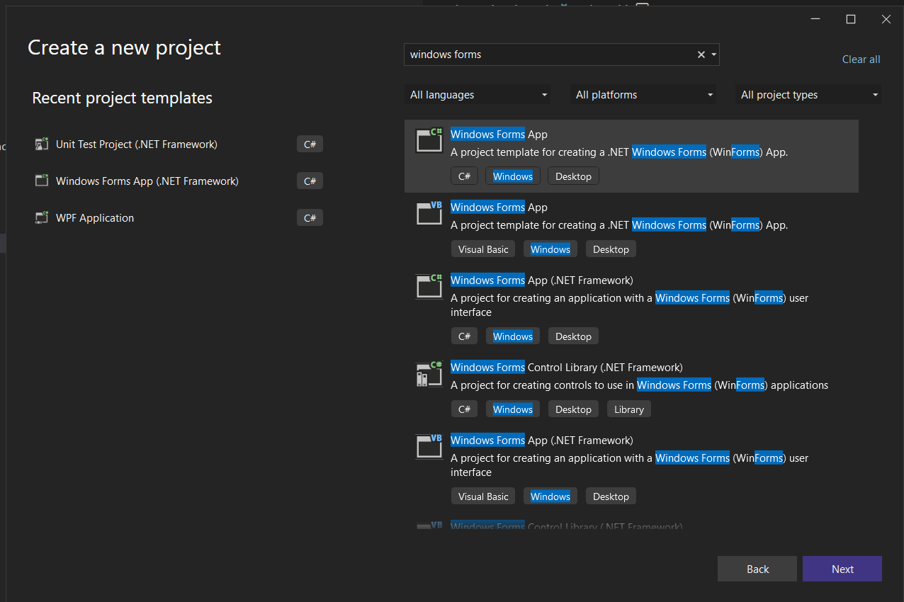
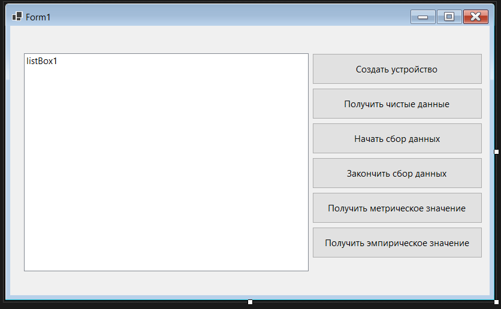

# Задание 1. Использование интерфейсов

## Содержание:

 - Интерфейс: [Часть 1.1](#Часть-11)
 - Перечисление: [Часть 1.2](#Часть-12)
 - Измерительное устройство: [Часть 1.3](#Часть-13)
 - Внешний вид программы: [Часть 1.4](#Часть-14)

Для начала создадим новый проект с графическим интерфейсом, лично я буду использовать старый добрый Windows Forms:



## Часть 1.1

Теперь добавим в новый элемент нажатием **Ctrl+Shift+A**, в котором мы будем хранить наш интерфейс измерительного прибора. Назовём его `MeasuringDevice.cs`

Теперь скопируем код с методички, кстати, документацию я перевёл я. Вот как должен выглядить файл после копирования:
 > p.s там есть кнопочка справа вверху кодового блока, можешь не выделять

## IMeasuringDevice

```C#
namespace MeasuringDevice
{
    public interface IMeasuringDevice
    {
        /// <summary>
        /// Преобразует необработанные данные, собранные устройством измерения, в значение в метрических единицах.
        /// </summary>
        /// <returns>Последнее измерение устройства преобразовано в метрические единицы.</returns>
        decimal MetricValue();

        /// <summary>
        /// Преобразует необработанные данные, собранные устройством измерения, в значение в имперических единицах.
        /// </summary>
        /// <returns>Последнее измерение устройства преобразовано в имперические единицы.</returns>
        decimal ImperialValue();

        /// <summary>
        /// Запускает сбор данных устройства измерения.
        /// </summary>
        void StartCollecting();

        /// <summary>
        /// Останавливает сбор данных устройства измерения.
        /// </summary>
        void StopCollecting();

        /// <summary>
        /// Предоставляет доступ к необработанным данным, собранным устройством измерения, в любых единицах, используемых устройством.
        /// </summary>
        /// <returns>Необработанные данные, собранные устройством измерения, в их сыром формате.</returns>
        int[] GetRawData();
    }
}
```

## Часть 1.2

Теперь нужно создать перечисление `Units`, которое описывает выбранную систему измерения (метрическая или империческая). Добавим новый элемент нажатием **Ctrl+Shift+A** и назовём его `UnitsEnumeration.cs`. Нам нужно объявить перечисление через ключевое слово `enum`, назвать `Units`. Членами перечисления должны быть `Metric` и `Imperial`. Также, можно добавить комментарии.

Вот как выглядит моя реализация вышесказанного:

## Units

```C#
namespace UnitsEnumeration
{
    /// <summary>
    /// Перечисление, которое используется для указания системы измерения.
    /// </summary>
    public enum Units
    {
        Metric,
        Imperial
    }
}
```

## Часть 1.3

Далее создадим класс `MeasureLengthDevice`, где нам нужно будет реализовать выше объявленный интерфейс. Для этого создадим файл `MeasureLengthDevice.cs` где этот класс и определим, также нам нужно установить уровень доступа public:

```C#
namespace WinFormsApp1
{
    public class MeasureLengthDevice
    {
    }
}
```

Теперь добавим наследование от нашего интерфейса [`IMeasuringDevice`](#imeasuringdevice)

```C#
using MeasuringDevice;

namespace WinFormsApp1
{
    public class MeasureLengthDevice: IMeasuringDevice
    {
    }

}
```

Теперь необходимо использовать мастера реализации интерфейса для создания заглушек методов для каждого из методов в интерфейсе IMeasuringDevice. Для этого нажимаем **CTRL + .**, после чего нажимаем **Реализовать интерфейс**. В итоге мы получаем класс с заглушками под методы интерфейса:

```C#
// ...
namespace WinFormsApp1
{
    public class MeasureLengthDevice : IMeasuringDevice
    {
        public int[] GetRawData()
        {
            throw new NotImplementedException();
        }

        public decimal ImperialValue()
        {
            throw new NotImplementedException();
        }

        public decimal MetricValue()
        {
            throw new NotImplementedException();
        }

        public void StartCollecting()
        {
            throw new NotImplementedException();
        }

        public void StopCollecting()
        {
            throw new NotImplementedException();
        }
    }

}
```

Теперь нам надо добавить перечисление DeviceType и класс DeviceController.
Поместим их в отдельные файлы, начнём с перечисления. Жмём **Ctrl+Shift+A**

DeviceType должен быть перечислением, состоящим из `LENGTH` и `MASS`.
Вот примерная реализация данного перечисления:

## DeviceType

```C#
namespace DeviceTypeNS
{
    public enum DeviceType
    {
        LENGTH,
        MASS
    }
}
```

Далее снова жмём **Ctrl+Shift+A** и добавляем класс DeviceController.
Класс пока что оставим пустым, вернёмся к нему позже.

```C#
namespace DeviceControllerNS
{
    internal class DeviceController
    {
    }
}
```

Теперь нужно вернуться к классу MeasureLengthDevice. В него нужно добавить поля из указанной таблицы:

| Модификатор доступа| Тип              | Название          |
|--------------------|------------------|-------------------|
| private            | Units            | unitsToUse        |
| private            | int[]            | dataCaptured      |
| private            | int              | mostRecentMeasure |
| private            | DeviceController | controller        |
| private            | DeviceType       | measurementType   |

Примерно так теперь должен выглядить класс после добавления полей:

```C#
using MeasuringDevice;
using UnitsEnumeration;
using DeviceControllerNS;
using DeviceTypeNS;

namespace WinFormsApp1
{
    public class MeasureLengthDevice : IMeasuringDevice
    {
        private Units unitsToUse;
        private int[] dataCaptured;
        private int mostRecentMeasure;
        private DeviceController controller;
        private DeviceType measurementType;
        public int[] GetRawData()
        {
            throw new NotImplementedException();
        }

        public decimal ImperialValue()
        {
            throw new NotImplementedException();
        }

        public decimal MetricValue()
        {
            throw new NotImplementedException();
        }

        public void StartCollecting()
        {
            throw new NotImplementedException();
        }

        public void StopCollecting()
        {
            throw new NotImplementedException();
        }
    }

}
```

Изменим поле measurementType, сделав его константным и инициализируем его как `DeviceType.LENGTH`

```C#
//...
public class MeasureLengthDevice : IMeasuringDevice
    {
        //...
        private const DeviceType measurementType = DeviceType.LENGTH;
        //...
    }
//...
```

Теперь нам нужно найти метод `StartCollecting`, а затем удалить тело метода по умолчанию, которое вставляет Visual Studio, что создает исключение `NotImplementedException`, добавить в метод `StartCollecting` код для создания экземпляра поля контроллера с помощью статического метода `StartDevice` класса `DeviceController`. Для этого нужно передать значение в поле MeasurementType в качестве параметра методу `StartCollecting`.

Кстати класс `DeviceController` у нас пуст, так что вернёмся к нему и придумаем
метод StartDevice. Ещё раз напомню что он из себя представляет: берёт `MeasurmentType` в качестве параметра, возвращает `DeviceController`.


Возможная реализация:

```C#
using DeviceTypeNS;
namespace DeviceControllerNS
{
    internal class DeviceController
    {
        DeviceType measurementType;

        public DeviceController(DeviceType measurementType)
        {
            this.measurementType = measurementType;
        }

        public static DeviceController StartDevice(DeviceType measurementType)
        {
            return new DeviceController(measurementType);
        }
    }
}
// Meow
```

Вернёмся обратно в `MeasureLengthDevice`. Нам нужно найти метод `StartCollecting`, а затем удалить тело метода по умолчанию, которое вставляет Visual Studio, что создает исключение `NotImplementedException`, добавить в метод `StartCollecting` код для создания экземпляра поля контроллера с помощью статического метода `StartDevice` класса `DeviceController`. Для этого нужно передать значение в поле MeasurementType в качестве параметра методу `StartCollecting`.

```C#
//...
public void StartCollecting()
{
    controller = DeviceController.StartDevice(measurementType);
}
//...
```

Теперь нам надо добавить метод `GetMeasurements`, его можно просто скопировать.

## GetMeasurements
```C#
private void GetMeasurements()
{
    dataCaptured = new int[10];
    System.Threading.ThreadPool.QueueUserWorkItem((dummy) =>
    {
        int x = 0;
        Random timer = new Random();
 
        while (controller != null)
        {
            System.Threading.Thread.Sleep(timer.Next(1000, 5000));
            dataCaptured[x] = controller != null ?
                controller.TakeMeasurement() : dataCaptured[x];
            mostRecentMeasure = dataCaptured[x]; 
            x++;
            if (x == 10)
            {
                x = 0;
            }
        }
    });
}
```

Заметили эту волнистую красную линию? Нажмите туда, а затем нажмите **CTRL + .**.
Затем нажмите создать метод **TakeMeasurment**. Линия пропадёт, но это ещё не всё.
Наводимся на метод, нажимаем **DeviceController**, таким образом переходим к определению этого класса.
Если не поняли мои махинации с хоткеями и остальным, то просто перейдите к классу `DeviceController`.

Найдём вот такой метод:

```C#
//...
internal int TakeMeasurement()
{
    throw new NotImplementedException();
}
//...
```

Visual Studio заботливо написал для нас тип возвращаемого значения `int` и заглушку.
Наша задача вместо заглушки возвращать какое-то число...

Моя реализация:

## TakeMeasurement

```C#
//...
internal int TakeMeasurement()
{
    Random random = new Random();
    return random.Next(1, 10);
}
//...
```

Продолжим путешествовать по коду. Теперь вернёмся к нашему классу `MeasureLengthDevice`.
Вообще, метод [GetMeasurments](#getmeasurements) призван эмулировать работу некоторого устройства,
которое производит замеры. Так что нам нужно добавить вызов этого метода в методе `StartCollecting`

```C#
//...
public void StartCollecting()
{
    controller = DeviceController.StartDevice(measurementType);
    GetMeasurements();
}
//...
```

Мы будем использовать код метода GetMeasurements для заполнения массива dataCaptured. Этот массив действует как циклический буфер фиксированной длины, перезаписывая самое старое значение каждый раз при выполнении нового измерения. Далее мы изменим этот класс, чтобы он реагировал на события, которые устройство вызывает всякий раз, когда оно обнаруживает новое измерение.

Найдём метод StopCollecting, а затем удалим тело метода по умолчанию, которое вставляет Visual Studio, что создает исключение NotImplementedException. Добавим условный блок кода, который запускается только в том случае, если объект `controller` не равен `null`.

```C#
//...
public void StopCollecting()
{
    if (controller != null)
    {

    }
}
//...
```

В условном блоке кода добавим код для вызова метода StopDevice объекта контроллера, а затем установим для поля контроллера значение null.

```C#
//...
public void StopCollecting()
{
    if (controller != null)
    {
        controller.StopDevice();
        controller = null;
    }
}
//...
```
controller подчёркивается зелёной волнистой линией. VS studio говорит, что controller не может быть
null. Таким образом надо слегка изменить наше поле.

```C#
//...
private int mostRecentMeasure;
private DeviceController? controller;  //*
private const DeviceType measurementType = DeviceType.LENGTH;
//...
```


А ещё, пора избавится от красной линии в `StopCollecting`. **CTRL + .**, создать метод **StopDevice**.
Переместимся в класс `DeviceController` и реализуем метод `StopDevice`.

Лично я поменял много кода. Вот возможная реализация класса `DeviceController`:

```C#
using DeviceTypeNS;

namespace DeviceControllerNS
{
    internal class DeviceController
    {
        DeviceType measurementType;
        bool isStopped;  // Новый код

        public DeviceController(DeviceType measurementType)
        {
            this.measurementType = measurementType;
            this.isStopped = false;  // Новый код
        }

        public static DeviceController StartDevice(DeviceType measurementType)
        {
            return new DeviceController(measurementType);
        }

        internal void StopDevice()
        {
            this.isStopped = true;  // Новый код
        }

        internal int TakeMeasurement()
        {
            if (!this.isStopped)  // Новый код
            {
                Random random = new Random();
                return random.Next(1, 10);
            }
            throw new Exception("Устройство остановлено, однако, была попытка сделать измерение");  // Новый код
        }
    }
}
```

Возвращаемся к классу `MeasureLengthDevice`

Найдём метод `GetRawData`, а затем удалим тело метода по умолчанию, которое вставляет Visual Studio, что создает исключение `NotImplementedException`. Добавим код для возврата массива `dataCaptured`.

Возможная реализация метода:

```C#
//...
public int[] GetRawData()
{
    return dataCaptured;
}
//...
```

Найдём метод MetricValue, а затем удалим тело метода по умолчанию. Добавим код для проверки `unitsToUse` и, если они метрические, вернём значение из поля `mostRecentMeasure`. Если текущие единицы измерения эмпирические, вернём результат умножения поля mostRecentMeasure на 25,4.

Возможная реализация метода MetricValue:

```C#
//...
public decimal MetricValue()
{
    switch (unitsToUse)
    {
        case Units.Metric:
            return mostRecentMeasure;
        case Units.Imperial:
            return (decimal)(mostRecentMeasure * 25.4);
        default:
            throw new NotImplementedException();
    }
}
//...
```

Найдём метод `ImperialValue`, а затем удалим тело метода по умолчанию. Добавим код для проверки `unitsToUse` и, если они эмпирические, вернём значение из поля mostRecentMeasure. Если текущие единицы измерения являются метрическими, вернём результат умножения поля mostRecentMeasure на 0,03937.

Возможная реализация метода `ImperialValue`:

```C#
//...
public decimal ImperialValue()
{
    switch (unitsToUse)
    {
        case Units.Metric:
            return (decimal)(mostRecentMeasure * 0.03937);
        case Units.Imperial:
            return mostRecentMeasure;
        default:
            throw new NotImplementedException();
    }
}
//...
```

Добавим в класс конструктор, который принимает параметр типа `Units` и задает для поля `unitToUse` значение, заданное этим параметром. Чтобы добавить конструктор можно нажать по названию класса и нажать
**CTRL + .**, после чего выбрать **Создать конструктор**. Ставим галочку только на **unitsToUse**.


Конструктор, который для нас любезно собрал VS studio:

```C#
//...
public MeasureLengthDevice(Units unitsToUse)
{
    this.unitsToUse = unitsToUse;
}
//...
```

Также, VS studio жалуется на `null` в `dataCaptured`, поэтому это следует исправить:

```C#
//...
public MeasureLengthDevice(Units unitsToUse)
{
    this.unitsToUse = unitsToUse;
    this.dataCaptured = new int[0];
}
//...
```

Дальше стоит запустить проект. Проект должен быть успешно собран.

## Часть 1.4

Итак, самое сложное позади, остался лишь интерфейс.

### Примерные требования к интерфейсу:
Listbox или что-то такое чтобы отображать данные.

Кнопка "Получить необработанные данные": выводит полученные данные на экран.

Кнопка создания устройства: Нужно создать экземпляр `MeasureLengthDevice` и записать в поле `device`.
При его создании необходимо использовать выбранную систему измерения.

Кнопка начала сбора: Нужно запустить метод StartCollecting на нашем измерительном устройстве.

Кнопка окончания сбора: Нужно как-то завершить сбор данных.

Кнопка "Метрическое значение": выводит последнее измерение устройства в метрической системе.

Кнопка "Эмпирическое значение": выводит последнее измерение устройства в эмпирической системе.

Пример интерфейса:




